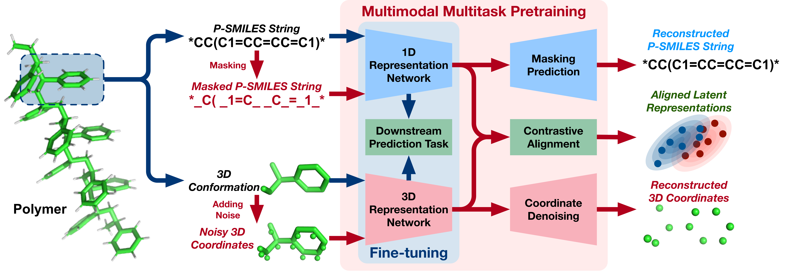

# MMPolymer: A Multimodal Multitask Pretraining Framework for Polymer Property Prediction
[](https://github.com/FanmengWang/MMPolymer/blob/master/LICENSE.txt)
[](https://pytorch.org/)


[[Paper]](https://dl.acm.org/doi/10.1145/3627673.3679684) [[Website]](https://bohrium.dp.tech/apps/mmpolymer) 


MMPolymer is a multimodal multitask pretraining framework that incorporates both 1D sequential and 3D structural information into polymer property prediction
<p align="center"></p>
<p align="center"><b>The overview of our proposed MMPolymer</b></p>


Website
------------
You can try MMPolymer online by clicking on this [link](https://bohrium.dp.tech/apps/mmpolymer)


Dependency
------------
- The code has been tested in the following environment
  | Package | Version |
  | --- | --- |
  | Python | 3.8.13 |
  | PyTorch | 1.11.0 |
  | CUDA | 11.3.1 |
  | RDKit | 2022.9.5 |
- Please install via the yaml file
  ```bash
  conda env create -f env.yml
  conda activate MMPolymer
  ```


Data Preparation
------------
The origin data have beed placed in the fold `./dataset/data`, and please further process these data as follows
  ```bash
  cd dataset
  python pretrain_data_process.py
  python finetune_data_process.py
  ```


Training
------------
Please download the [checkpoint](https://drive.google.com/file/d/1A_5_dzVYuA2ZG4Bb9POfkzEEjkLb7WiE/view?usp=sharing) and place it to the fold `./ckpt`
  ```bash
  bash train.sh
  ```


Inference
------------
  ```bash
  bash inference.sh
  ```


Application
------------
After training, you can use following scripts for actual application
- Take psmiles (e.g., \*CC(\*)C) as input and predict all properties
  ```bash
  python get_prediction_results.py --input_data '*CC(*)C'
  ```
- Take a csv file as input and predict all properties
  ```bash
  python get_prediction_results.py --input_data $CSV_FILE_PATH 
  ```
- If you just want to predict a specific property (e.g., Eat) 
  ```bash
  python get_prediction_results.py --input_data '*CC(*)C' --property Eat
  python get_prediction_results.py --input_data $CSV_FILE_PATH --property Eat
  ```


Citation
------------
If this work can help you, please cite it 
```
@inproceedings{wang2024mmpolymer,
author={Wang, Fanmeng and Guo, Wentao and Cheng, Minjie and Yuan, Shen and Xu, Hongteng and Gao, Zhifeng},
title = {MMPolymer: A Multimodal Multitask Pretraining Framework for Polymer Property Prediction},
booktitle = {Proceedings of the 33rd ACM International Conference on Information and Knowledge Management},
location = {Boise, ID, USA},
year = {2024},
series = {CIKM '24}
}
```


Acknowledgment
--------
This code is built upon [Uni-Mol](https://github.com/dptech-corp/Uni-Mol) and [Uni-Core](https://github.com/dptech-corp/Uni-Core). Thanks for their contribution.
